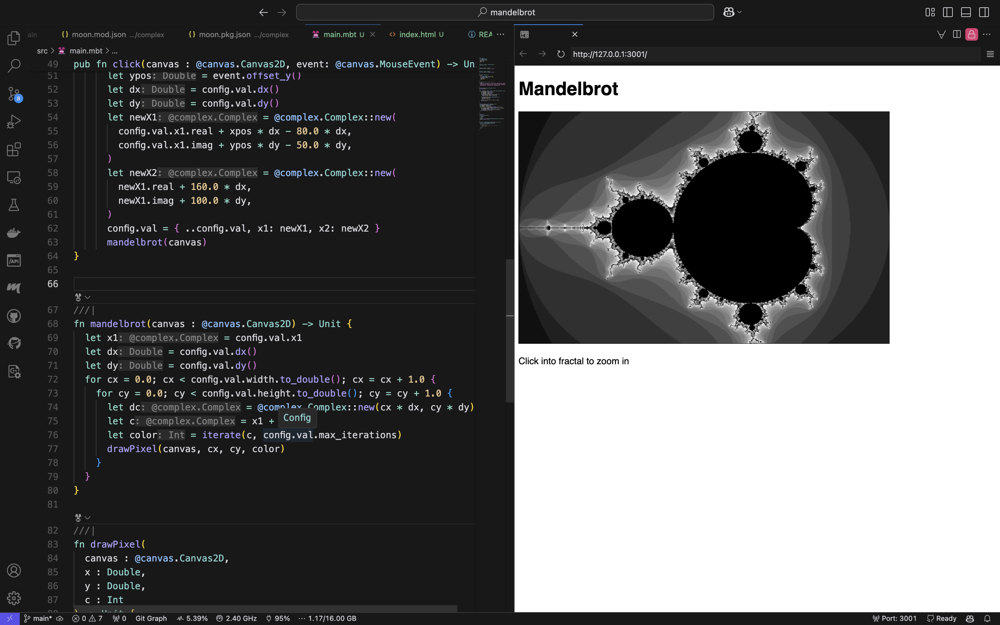

# justjoheinz/mandelbrot

Calculate the Mandelbrot set with MoonBit Webassembly.

Either open the project with Live Preview in VS Code or 

```sh 
moon install
moon build 
python -m http.server 3000 
# new terminal, open browser
open http://localhost:3000/
```

)